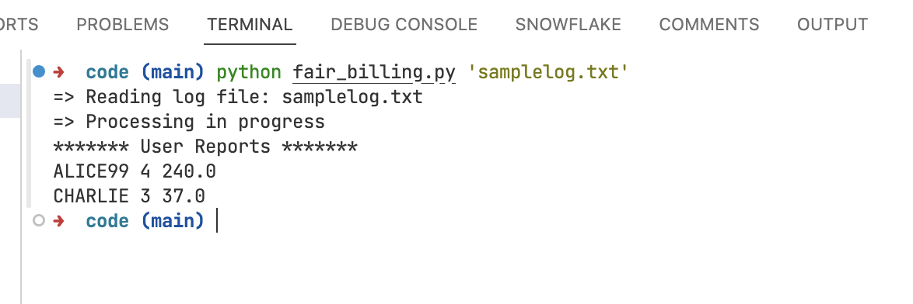

# Fair Billing

Fair Billing is a Python program designed to analyze log files containing user session data and calculate information based on the duration of user sessions.

With Fair Billing, you can gain insights into user behavior, identify patterns, and ensure fair billing practices based on actual usage. Whether you're analyzing user activity for billing purposes or optimizing resource allocation, Fair Billing provides the tools you need to make informed decisions.

### Features

- Log File Processing: Reads log files containing user session data.
- Session Calculation: Calculates the duration of each user session.
- Fair Billing: Generates fair billing information for each user based on their session durations.
- Session Frequency Analysis: Determines the number of sessions each user has participated in.
- Error Handling: Handles errors gracefully, including file not found and invalid log data.

### Usage
With Fair Billing, you can gain insights into user behavior, identify patterns, and ensure fair billing practices based on actual usage. Whether you're analyzing user activity for billing purposes or optimizing resource allocation, Fair Billing provides the tools you need to make informed decisions.

1.Installation:

    - Clone this repository to your local machine or extract the zip file.

`git clone https://github.com/prashant-yadav-dev/code.git`

    - Make sure Python3 is installed on your system.

2.Run the Program:

- Navigate to the directory containing the Fair Billing program.
- Run the program by executing the following command in your terminal:
- On windows run the following command

```shell
  python fair_billing.py 'samplelog.txt'
```

- On mac, run the following command

```shell
  python3 fair_billing.py 'samplelog.txt'
```


- Replace _samplelog.txt_ with the path to your log file.

  3.View Results:

- The program will process the log file and print the fair billing information for each user to the console.

### Input Format

The input log file should contain lines in the following format:
14:02:03 ALICE99 Start
14:02:05 CHARLIE End
14:02:34 ALICE99 End
14:02:58 ALICE99 Start
14:03:02 CHARLIE Start
14:03:33 ALICE99 Start

### Output Format

username number_of_session total_session_time
username: Unique identifier for the user.
number_of_session: The total number of sessions for the user.
total_session_time: The total duration of all sessions for the user in seconds.

Sample Output:

```python
ALICE99 4 240
CHARLIE 3 37
```



### Error Handling
If the specified log file is not found or if there is any other error during processing, an appropriate error message will be displayed.

Feel free to customize this README file further according to your needs and preferences!

### Contact Information
If you encounter any issues or need assistance with the Fair Billing program, feel free to reach out to me via email at yadavprashant510@gmail.com or by phone at 9702466709. I'll do my best to help you resolve any problems you may encounter with the code.
